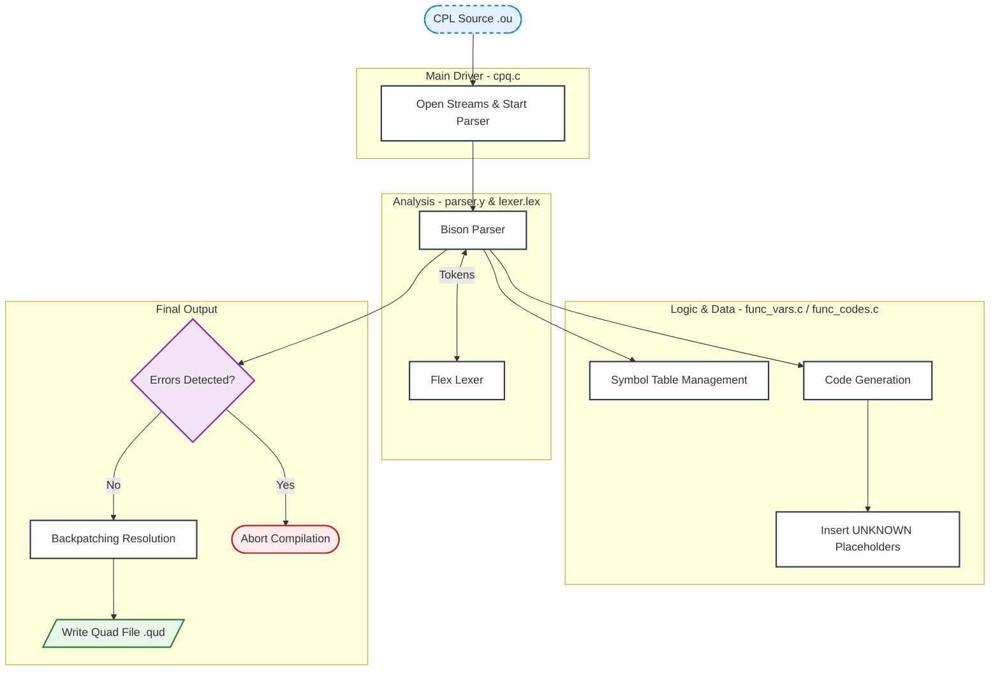
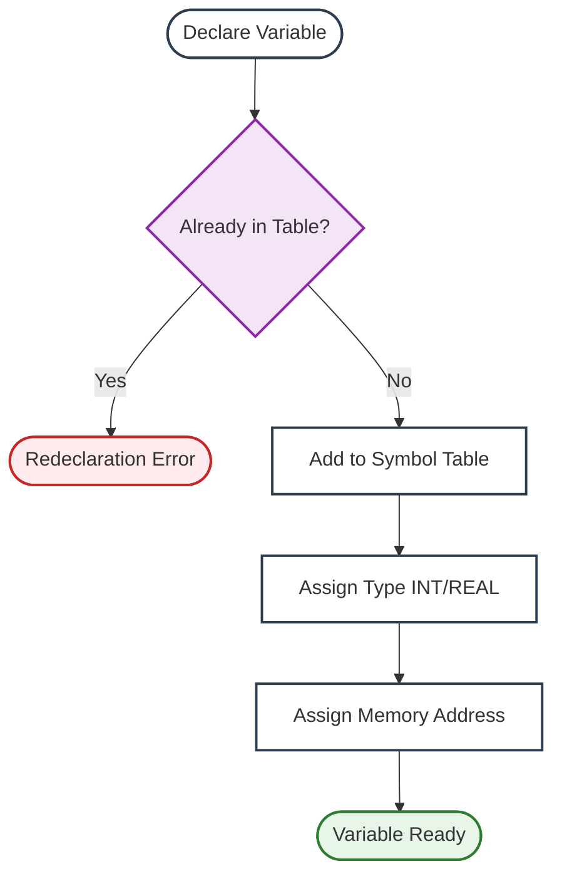
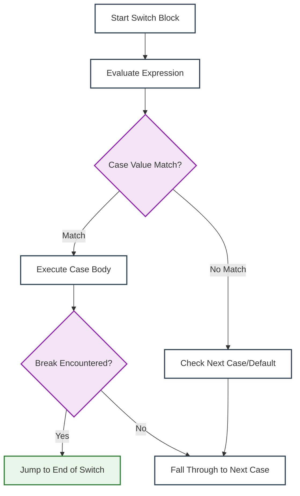

# CPL Compiler Project (Overview)

**Final Project | Compilation Course | The Open University of Israel**


> **Disclaimer:** This project overview and examples are for educational and portfolio purposes only. 
> All course-provided examples have been replaced or adapted to avoid copyright issues. 
> No proprietary content from The Open University of Israel is included.

A fully functional **Single-Pass Compiler** that translates **CPL (Compiler Project Language)** source code (`.ou`) into **Quadruple (Quad)** intermediate representation (`.qud`).

Built using **Flex** and **Bison**, the compiler executes lexical, syntactic, and semantic analysis simultaneously, generating low-level code on-the-fly without the memory overhead of an Abstract Syntax Tree (AST).


## 📖 Table of Contents

1. [Language Specifications](#language-specifications)
2. [Compiler Architecture](#compiler-architecture)
   - [Semantic Attribute Mapping](#semantic-attribute-mapping)
   - [Core Data Structures](#core-data-structures)
3. [Key Implementation Features](#key-implementation-features)
4. [Examples](#examples)
5. [File Structure](#file-structure)
6. [Build & Execution Guide](#build--execution-guide)

---

## Language Specifications

### 1. Source Language: CPL
CPL is a structured, case-sensitive language inspired by C++.
* **Tokens:** Keywords (`if`, `else`, `while`, `switch`, `break`), relational operators (`==`, `!=`, `<`, etc.), arithmetic operators.
* **Typing:** Supports `int` and `float` with automatic type promotion.
* **Casting:** Explicit type conversion via `static_cast<int>` and `static_cast<float>`.
* **Comments:** C-style comments `/* ... */`.

### 2. Target Language: Quad
A low-level intermediate language where each instruction has up to 3 operands.
* **Typed Opcodes:** Distinguishes between integer (e.g., `IADD`) and real (e.g., `RADD`) operations.
* **Control Flow:** Uses numeric line numbers for jumps.

---

## Compiler Architecture

The CPL compiler is **single-pass**, performing analysis and code generation simultaneously. This reduces memory overhead and ensures **immediate semantic validation**.


### Explanation:

* **Driver** (`cpq.c`): Opens files, validates input, triggers parser
* **Lexer** (`lexer.lex`): Tokenizes source code, tracks lines
* **Parser** (`parser.y`): Validates syntax, triggers semantic actions
* **Symbol Table** (`func_vars.c`): Registers variables, prevents redeclaration
* **Code Generation** (`func_codes.c`): Creates Quadruple instructions
* **Backpatching**: Resolves jump placeholders (`UNKNOWN_BREAK`, `UNKNOWN_CASE`)

---

### Semantic Attribute Mapping
Every grammar rule in `parser.y` asses semantic info using `yylval` union:

| Semantic Attribute | Meaning |
|:---|:---|
| `op` | Operator kind (`ADD`, `SUB`, `MUL`, etc) |
| `name` | Variable name |
| `val` | Numeric value |
| `type` | Data type (`INT`, `FLOAT`, `CAST`) |
| `var` | Pointer to **Symbol Table** node |
| `codeSegment` | Generated Quad instructions linked list |
| `lexLine` | Source line number (for error reporting) |

---

### Core Data Structures

The compiler relies on two primary data structures optimized for a **single-pass** approach:

#### 1️⃣ Symbol Table (`func_vars.c`)

* **Array of 26 linked lists** (a–z) for fast lookup.
* Tracks name, type, and memory address.
* Prevents redeclarations and ensures declaration before use.



#### 2️⃣ Code Segment (`func_codes.c`)
* Linked list of Quadruples with head/tail pointers for *O(1)* insertion.
* Stores intermediate instructions as they are generated.



---

## Key Implementation Features

### 🔁 Backpatching & Control Flow
* Handles unknown jump destinations during parsing.
* Inserts placeholders (`UNKNOWN_CASE`, `UNKNOWN_BREAK`) and resolves them after the block is parsed.
* Supports C-style `switch-case` fall-through.

### 🔼 Type Coercion & Promotion
* Automatic promotion of `int` → `float`.
* Correct opcode selection (`IADD`/`RADD`, etc.).
* Handles static_cast conversions (`ITOR`, `RTOI`).

### ❌ Error Handling
* Detects lexical, syntax, and semantic errors.
* Prints errors with source line numbers.
* Compilation **does not produce output** if any errors exist.

---

## Examples

### Example 1: Switch-Case

#### Source Code (`examples/switch_example.ou`)

```c
/* program which includes switch and break */

var1, var2: int;
{
	input(var1);
	input(var2);

	switch(var1 + var2)
	{
		case 10: output(10);
		case 20: output(20);
			break;
		case 30: output(30);
			break;
		default: output(var1);
			output(var2);
	}
	
	input(var1);
	input(var2);
}
```

#### Generated Quadruples:

| Line | Instruction    | Explanation                     |
|------|---------------|---------------------------------|
| 1    | IINP var1      | Read integer into `var1`       |
| 2    | IINP var2      | Read integer into `var2`       |
| 3    | IADD t1 var1 var2 | `t1 = var1 + var2`           |
| 4    | IEQL 10 t1     | Check if `t1 == 10`            |
| 5    | IPRT 10        | Output 10 (Fall-through follows) |
| 6    | IEQL 20 t1     | Check if `t1 == 20`            |
| 7    | IPRT 20        | Output 20                       |
| 8    | JUMP 14        | Break: Jump to the end of switch |
| 9    | IEQL 30 t1     | Check if `t1 == 30`            |
| 10   | IPRT 30        | Output 30                       |
| 11   | JUMP 14        | Break: Jump to the end of switch |
| 12   | IPRT var1      | Default: Output `var1`          |
| 13   | IPRT var2      | Default: Output `var2`          |
| 14   | IINP var1      | End of switch: Next instruction |
| 15   | IINP var2      | ...                              |
| 16   | HALT           | End of program                  |

---

### Example 2: Error Handling

#### Source Code (`inputs/errors_example.ou`)

```c
/* ======================== */
/* possible errors          */
/* ======================== */

first, second: float;
a, b: int;
a: float; /* expecting error- duplicate declaration */
{
	break; /* expecting error- break appears not inside while/switch */

	/* ==============*/
	/* variables     */
	/* ==============*/
	output(aa); /* expecting error- variable 'aa' undeclared */

	a = static_cast<int>(c); /* expecting error- variable 'c' is undeclared */
	a = c;

	/* ==============*/
	/* casting       */
	/* ==============*/

	break; /* expecting error- break appears not inside while/switch */

	a = first; /* expecting error- cannot convert float to int */
	a = 10.4;  /* expecting error- cannot convert float to int */
	a = static_cast<float>(first); /* expecting error- cannot convert float to int */
	b = static_cast<float>(a); /* expecting error- cannot convert float to int */

	/* ==============*/
	/* switch        */
	/* ==============*/

	switch(first) /* expecting error- switch expression type */
	{
		case 1: output(first);
		case 2: output(second);
			break;
		default:
	}

	switch(a)
	{
		case 1: output(first);
		case 2.0: output(second); /* expecting error- case number type */
			break;
		default:
	}

	break; /* expecting error- break appears not inside while/switch */
}
```

#### Compiler reports

```bash
error line 7: duplicate variable declaration 'a'
error line 14: undeclared variable 'aa'
error line 16: undeclared variable 'c'
error line 17: undeclared variable 'c'
error line 25: cannot convert float to int
error line 26: cannot convert float to int
error line 27: cannot convert float to int
error line 28: cannot convert float to int
error line 34: switch expression type must be integer
error line 45: case number type must be integer
error line 9: break command can appear only in switch or while statements
error line 23: break command can appear only in switch or while statements
error line 50: break command can appear only in switch or while statements
=============================================
Compiler was unable to produce an output
due to the errors mentioned above.
=============================================
```

---

## File Structure

```
CPL-Compiler/
│
├── src/                  # Source code and compiler implementation
│   ├── cpq.c             # Main driver of the compiler
│   ├── lexer.lex         # Flex lexical analyzer
│   ├── parser.y          # Bison grammar and semantic actions
│   ├── header.h          # Global structures and definitions
│   ├── func_vars.c       # Symbol table management
│   ├── func_codes.c      # Intermediate code generation
│   └── func_helpers.c    # Utility/helper functions
│
├── Makefile              # Build configuration
├── README.md             # Project documentation
│
├── inputs/               # CPL source files (.ou)
│   ├── test1.ou
│   ├── test2.ou
│   └── ...
│
├── outputs/              # Generated quadruple files (.qud)
│   ├── test1.qud
│   ├── test2.qud
│   └── ...
│
└── obj/                  # Object files (created during build)
```

---

## Build & Execution Guide

### 1️⃣ Prerequisites

* Linux (Ubuntu/Debian) or WSL
* gcc, flex, bison, make

```bash
sudo apt update
sudo apt install flex bison build-essential
```

### 2️⃣ Build

```bash
make
```

### 3️⃣ Run a Sample Program

```bash
./cpq inputs/test.ou
```

* Output: `outputs/test.qud`
* Shows Quadruple representation of the CPL program.

### 4️⃣ Clean

```bash
make clean
```
Removes compiled objects and executable.

---

## Credits

Developed as part of the **Compilation Course at The Open University of Israel**.
